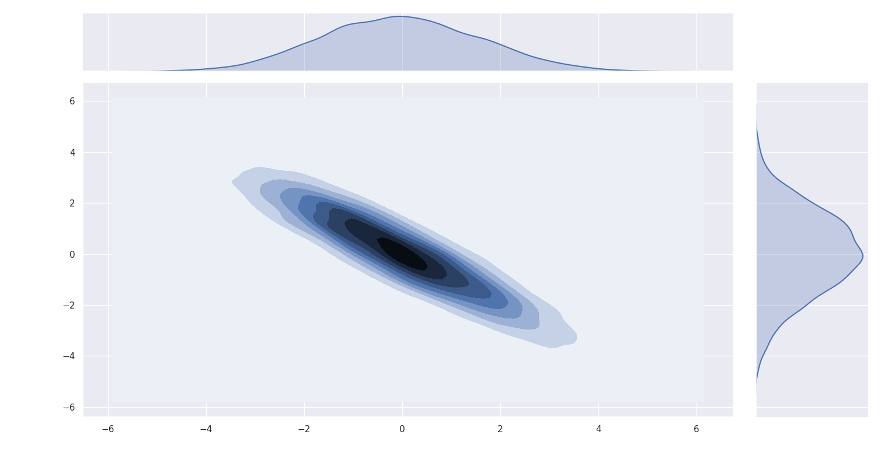
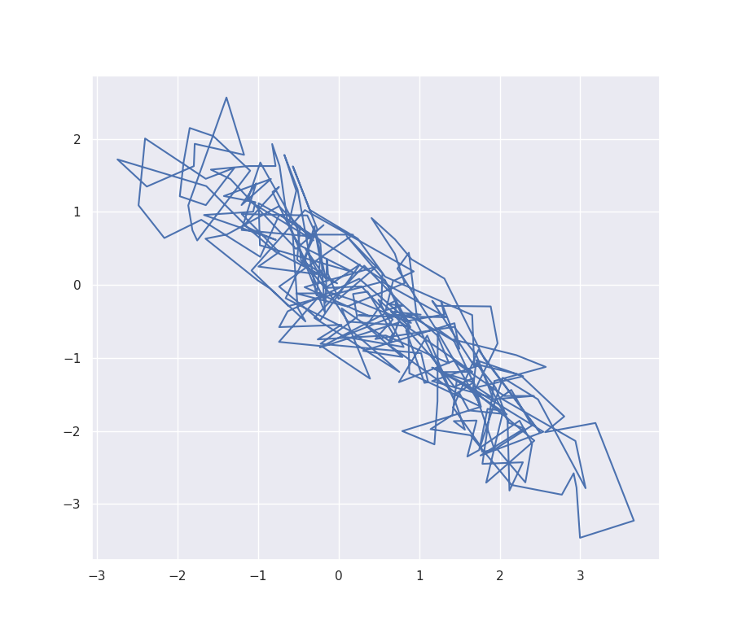
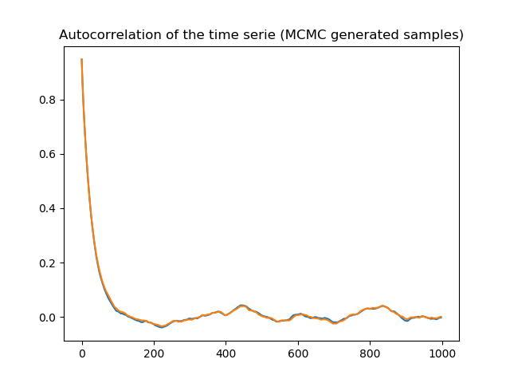

# MCMC

## Description

MCMC is a python implementation of some MCMC sampler algorithms that can leverage pyTorch's automatic differentiation to sample from a given (unormalized or not) density distribution.

For instance, if we were to sample from a Gaussian distribution using MALA algorithm, one can do like in the `mcmc_test.py` file and get the following kernel density estimation:


A sample from the MCMC trajectory is:


Within the `mala_test.py` file, one can also find a small function to compute autocorrelation and check that the Markov Chain "mixes" well:



To help tuning parameters of the MALA algorithm, it is possible to print the acceptation ratio. A good empirical fit for this is around 63%. It means that the chain is exploring enough so that around 63% of the propositions are accepted as the next step.

One can also find a small tutorial in the `tutorial.ipynb` file.

## Practical use

A useful example can be found in `mala_test.py` as well as in the `tutorial.ipynb`.

The repository is organized around two files:
- `mcmc.py` which contains several classes associated to MCMC sampler algorithms. Since we need a density function and a gradient in Langevin methods, one can find an important class in the next file.
- `function.py` which contains one class, **MODEL**,  that is used by the MCMC classes. **MODEL** should contains all the information one have about the distribution one whish to sample from. The bare minimum is either an (unormalized) density or log-density. This function should be written using pyTorch only function so that one can use autodifferentiation to compute gradient of the log-density with respect to the input. However, if the gradient is known, you can still use it in the **MODEL**.

## Example

Assume that one have an implementation of the *density* function we whish ta sample from. Then a minimal working example would be like:
```
from mcmc import MALA
from function import MODEL

DIMENSION_INPUT_SPACE = int nbr
GRADIENT_STEPSIZE = float nbr
RANDOM_STEPSIZE = float nbr
INITIAL_POINT = torch.randn(DIMENSION_INPUT_SPACE)
NBR_SAMPLES = int nbr


def density_to_sample_from(x):
    # ...
    # Some pyTorch thingsgummy
    # ...
    return density_at_x

# Create probabilistical model
probabilistical_model = MODEL(density=density_to_sample_from)

# Create MCMC method
mala_mcmc = MALA(probabilistical_model, metric=torch.eye(DIMENSION_INPUT_SPACE),
                 gradient_step=GRADIENT_STEPSIZE,
	         random_step=RANDOM_STEPSIZE,
	    	 initialization=INITIAL_POINT)

# Sample
SAMPLES = mala_mcmc.fit(NBR_SAMPLES)

# Then one can plot some dimensions
# Please see mala_test.py or tutorial.ipynb
```
